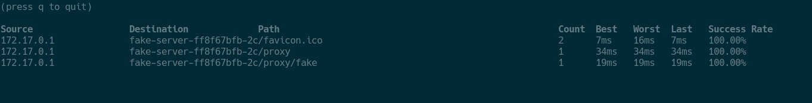
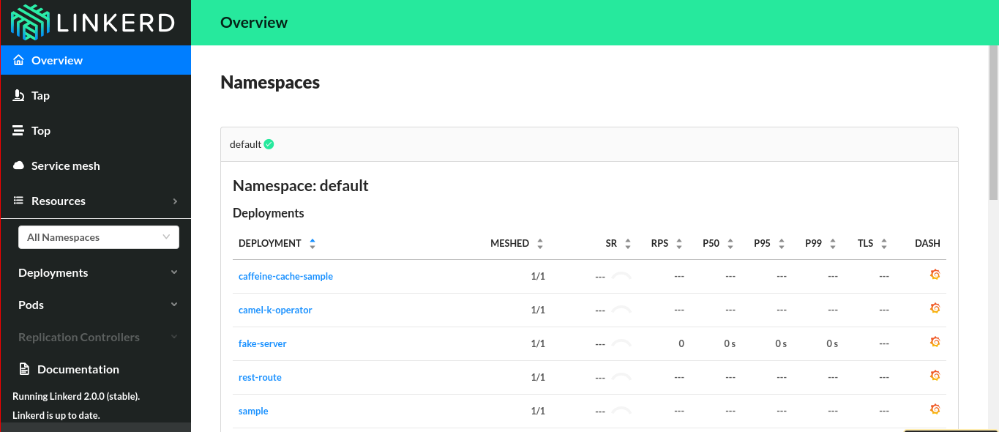
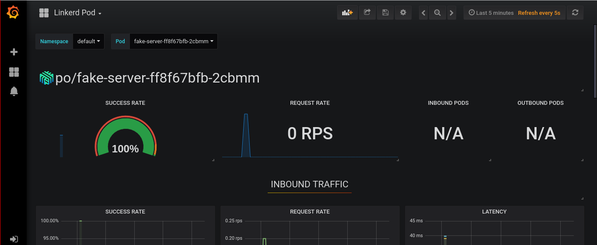

# Service Mesh (POC)

Highly inspired by [this blog post](https://blog.buoyant.io/2017/04/25/whats-a-service-mesh-and-why-do-i-need-one/).

## What and How

### Start minikube

```bash
~$ minikube start --vm-driver=virtualbox
```

### Kubernetes dashboard

[Kubernetes dashboard](http://localhost:8001/api/v1/namespaces/kube-system/services/kubernetes-dashboard:/proxy/#!/overview?namespace=_all).

```bash
~$ kubectl proxy
```

### ~Kubernetes docker registry~

Tried to kubernetes docker registry as default ```eval $(minikube docker-env)```
but didn't work as expected. So, I pushed my **fake-service** image to my docker hub as alexsuzume/fake-service.

### Kompose

Create deploy yml with [Kompose](https://github.com/kubernetes/kompose).

```bash
~/path/to/project/$ kompose convert -f docker-compose.yml -o deploy.yml`
```

### Deploy

Easy:
```bash
~/path/to/project/$ kubectl create -f deploy.yml
```
Expose deploy:
```bash
~$ kubectl expose deployment fake-server --name fake-server-lb --type=LoadBalancer --port 8080
```
Test it!
```bash
~$ curl $(minikube service fake-server-lb --url)
```

### Linkerd

* Install [linkerd](https://linkerd.io/2/getting-started/).
* Mesh services ```kubectl get -n default deploy -o yaml | linkerd inject - | kubectl apply -f -```

### And now?

Linkerd deployed a lot of side-cars to our services in a way that doesn't change how they work.
In Linkerd words *The service mesh is a networking model that sits at a layer of abstraction above TCP/IP.*.
Now we can see data about our services in many different ways:

See stream of requests for our deployed fake-server ```~$ linkerd -n default top deploy/fake-server #deploy/[deploy name]```.



Start linkerd dashboard ```~$ linkerd dashboard``` and access:

Linkerd dashboard:


Graphana:


Enjoy! :heart:

## Meta

Still here? I'm really amazed at how simple Linkerd is and how much value it adds to development, for sure I will
try to add this to my current projects. The old "one layer" of metrics and health checks for all my services never really worked and this is a really clever alternative.

Alex Rocha - [about.me](http://about.me/alex.rochas)
